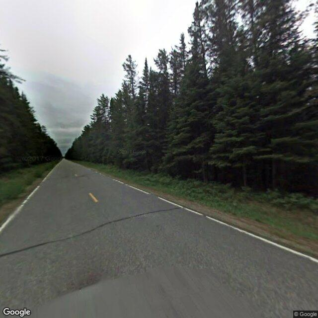
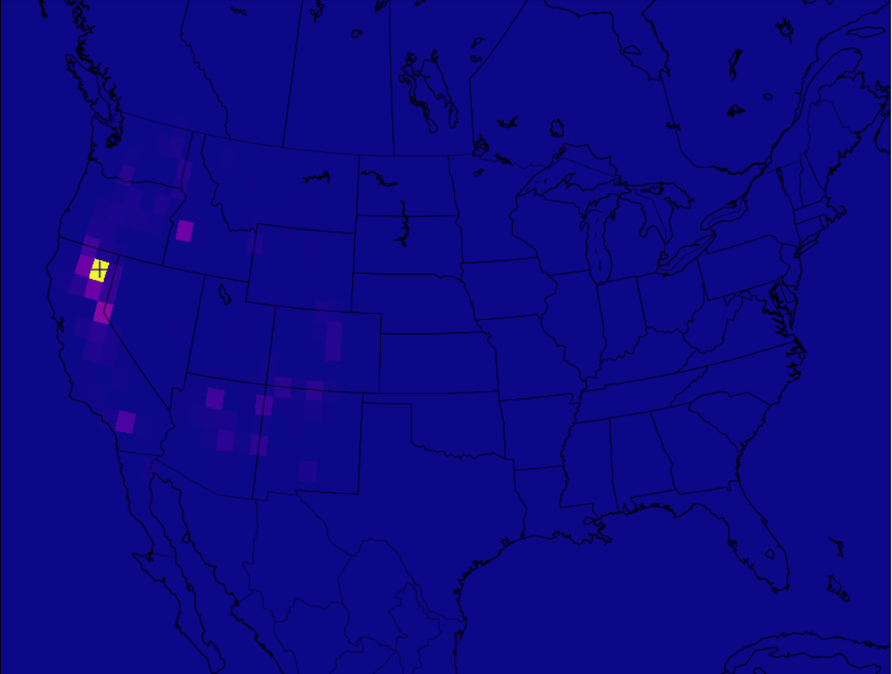

# Geoguessr-AI
## What is it?
Geoguessr is a game where you are given a random location in Google Streetview, then tasked with determining where you are using only what you can see around you. The game can be deceptively difficult, so I decided to see if I could use my knowledge of machine learning to make an AI that could solve this tricky problem.
 
## What does it do?
Using the AI is simple: First take a screenshot of a location in google streetview (In the US).  
 
Then, the neural network predicts where it is located in the US. This prediction can be displayed on a map like so. The exact coordinates are also displayed.
 
In this map, a lighter color means the AI is more confident in that location. The '+' icon represents the area of highest confidence. 
According to my testing, the AI is only around 500 miles off on average, which is pretty good considering it only has one small image to work with. That's significantly better than a human like me.
## How does it work?
This AI utilizes a convolutional neural network to make predictions. This means that it is visually determining the location of the image. For outputting guesses, the neural network uses one-hot encoding over 1,416 outputs to estimate the latitude and longitude of an image to the nearest degree.  
Note: due to file limitations on github, the training data and models are not included in this repository
